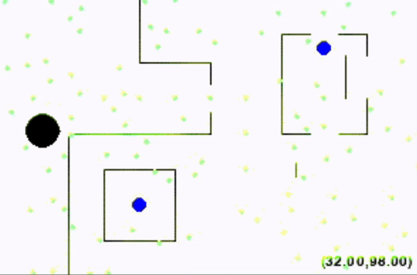

## Sub-project details

A repository containing sub-projects relating to an application of concepts within Artificial Intelligence and Machine Learning using Python libraries such as: OpenCV, PyTorch, Pandas, Scikit-learn. These projects include a variety of topics, such as but not limited to:

### Reinforcement Learning Snake Game:

### Hidden Markov Model Part-of-Speed Tagger:

## UIUC Academic Integrity

DO NOT COPY. Only for reference. I hereby state that I shall not be held responsible for any misuse of my work or any academic integrity violations.